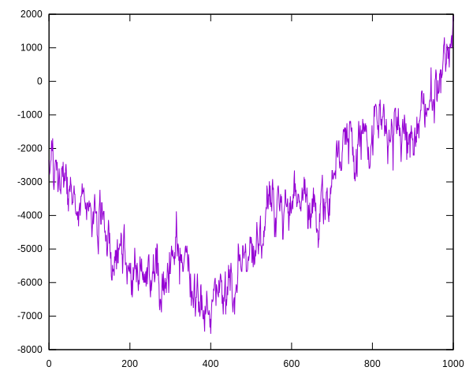

# Intro

https://content.neuralink.com/compression-challenge/README.html

```
wget -q https://content.neuralink.com/compression-challenge/data.zip
unzip -q data.zip
mkdir -p data/.0
ls data/*.wav | awk '{printf "ln -f \"%s\" data/.0/%03d.wav \n", $0, NR - 1}' | sh
```

Dump
```
python dump.py data/.0/000.wav
-1570
-2018
-2338
-1634
...
```

<p align="center"></p>
<p align="center"></p>
